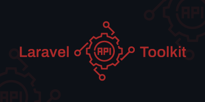

# Laravel API tool kit



Laravel api tool kit is a set of tools that will help you to build a fast and well-organized API using laravel best practices.

## Contents

[Installation](#installation)

[Api response](#api-response)

[Dynamic Pagination](#dynamic-pagination)

[Filters](#filters)

[Api Generator](#api-generator)

[comment]: <> ([Out of the box permissions]&#40;#out-of-the-box-permissions&#41;)

[Actions](#actions)

[Media Helper](#media-helper)

[Enum](#enum)

[General tips](#general-tips)


## **Installation**

```
composer require essa/api-tool-kit
```
to publish config
```
php artisan vendor:publish --provider="Essa\APIToolKit\APIToolKitServiceProvider" --tag="config"
```

use exception handler to standardize the error response [Error Response](#error-response)

in App\Exceptions\Handler class extend the APIHandler class
```php

namespace App\Exceptions;

use Essa\APIToolKit\Exceptions\Handler as APIHandler;

class Handler extends APIHandler
{
}

```

use API Response Trait in Controller

`App\Http\Controllers\Controller.php`:

```php
use Essa\APIToolKit\Api\ApiResponse;

class Controller extends BaseController
{
    use ApiResponse;
}
```
check : [API response](#api-response)

[🔝 Back to contents](#contents)

## **API Response**

it is used to format your response to standard format and status codes
for success responses, it will be

#### **Success Response**
```json
{
  "message": "your message",
  "data": "your date"
}
```
#### **Error Response**
```json
{
  "errors": [
    {
      "status": 403,
      "title": "unauthenticated!",
      "detail": "Unauthenticated."
    }
  ]
}
```

usage:
you can use the trait inside the class you want to return the response form

and use it like this

```php
$this->responseSuccess('car created successfully' , $car);
```
Available Methods
```php

responseSuccess($message , $data)  // returns a 200 HTTP status code
responseCreated($message,$data)  // returns a 201 HTTP status code 
responseDeleted()  // returns empty response with a 204 HTTP status code
responseNotFound($error_details,$error_title)  // returns a 404 HTTP status code
responseBadRequest($error_details,$error_title)  // returns a 400 HTTP status code
responseUnAuthorized($error_details,$error_title)  // returns a 403 HTTP status code
responseConflictError($error_details,$error_title)  // returns a 409 HTTP status code
responseUnprocessable($error_details,$error_title)  // returns a 422 HTTP status code
responseUnAuthenticated ($error_details,$error_title) // returns a 401 HTTP status code
responseWithCustomError($error_title, $error_details, $status_code) //send custom error 
```
[🔝 Back to contents](#contents)

## **Dynamic Pagination**

use pagination dynamically

#### usage
to use dynamic pagination to get all users :
```php
$users = User::dynamicPaginate();
```
to get all users without pagination :
```
\users?pagination='none'
```
to get all users paginated 10 users per page:
```
\users?per_page=10
```
by default pagination is 20 element per page you can change the default value from config/api-tool-kit
## **Filters**

usage:

to create a filter class:
```
php artisan make:filter CarFilters
```
to set default filters to the Car model , in Car model you will add
```php
protected $default_filters = CarFilters::class;
```
to use it

```php
Car::useFilters()->get();
```
if you want to override the default filters

```php
Car::useFilters(SpecialCaseCarFilters::class)->get();
```
options in Filter class

```php
//to add the attributes to filter by =>> /cars?color=red&model_id=1
protected array $allowedFilters  = ['color' , 'model_id']; 
//to add the attributes to filter by :
// desc : ?sorts=created_at
// asc  : ?sorts=-created_at
protected array $allowedSorts= ['created_at'];
//allowed relationships to be loaded 
protected array $allowedIncludes = ['model'];
//column that will be included in search =>> ?search=tesla
protected array $columnSearch= ['name','descriptions']; 
//relation that will be included in search =>> ?search=ahmed
protected array $relationSearch = [
    'user' => ['first_name', 'last_name']
]; 
```

to create a custom query you will just create a new function in the class and add your query
example filter by year:
```php
public function year($term)
{
    $this->builder->whereYear('created_At', $term);
}

//usage : /cars?year=2020
```
filter by relationship :
```php 
public function option($term)
{
    $this->builder->whereHas('options', fn($query) => $query->where('option_id', $term));
}
//usage : /cars?option=1
```


[🔝 Back to contents](#contents)

## **API Generator**

#### Usage :

```
php artisan api:generate Car
```

when you type the command it will ask you whether you want default options :
- (N) it will ask you which files you want to generate .
- (Y) it will generate files for all options that exists in config/api-tool-kit
##### options :
```
 ** by default it will create a model :
-app/Models/Car.php
 ** controller :
-app/Http/Controllers/API/CarController.php
 ** resource :
-app/Http/Resources/CarResource.php
 ** request :
-app/Http/Requests/Car/CreateCarRequest.php
-app/Http/Requests/Car/UpdateCarRequest.php
 ** filter :
-app/Filters/CarFilters.php
 ** seeder :
-database/seeders/CarSeeder.php
 ** factory :
-database/factories/CarFactory.php
 ** test :
-Tests/Feature/CarTest.php
 ** migration :
-database/migrations/x_x_x_x_create_cars_table.php
```
in addition, the routes will be created and added in routes/api.php files


[🔝 Back to contents](#contents)
## **Actions**
action is a laravel implementation of command design pattern which create a class where you can add your business logic in https://en.wikipedia.org/wiki/Command_pattern

usage:

```
php artisan make:action CreateCar
```

```php
<?php
namespace App\Actions;

class CreateCar
{
    public function execute($data)
    {
      //add business logic to create a car
    }
}
```
The best practice to use the action class is to use dependency injection

you have many options
1-use laravel application container
```php
app(CreateCar::class)->execute($data);
```
2-inject it in the class in constructor

```php
private $create_car_action ;

public function __construct(CreateCar $create_car_action)
{
    $this->create_car_action=$create_car_action;
}

public function doSomething()
{
    $this->create_car_action->execute($data);
}
```
3-inject the class in laravel controller function

```php
public function doSomething(CreateCar $create_car_action)
{
    $create_car_action->execute($data);
}
```
[🔝 Back to contents](#contents)


## **Media Helper**

it is used to upload and delete files to storage

```php
// to upload file
$file_path = MediaHelper::uploadFile($file ,$path); 
//to delete an file
MediaHelper::deleteFile($path); 
//upload multiple files
$files_paths = MediaHelper::uploadMultiple($files ,$path); 
//upload base64 image
$image_path = MediaHelper::uploadBase64Image($encoded_image ,$path); 
```

[🔝 Back to contents](#contents)

## **Enum
bad practice :
if I have two types of users (admin ,student) instead of hard coding the name of user type every time using it you can simply use the enum class

usage :
```
php artisan make:enum UserTypes
```
it will generate classes like this
```php
namespace App\Enums;

class UserTypes extends Enum
{
    public const ADMIN = 'admin';
    public const STUDENT = 'student';
}
```
methods:
```php
UserTypes::getAll() //get all types 
UserTypes::isValid($value) //to check if this value exist in the enum
UserTypes::toArray() //to get all enums as key and value
```

[🔝 Back to contents](#contents)

## **General Tips**

### **throw error instead of return json response**

Bad:

```php
public function index()
{
    if (auth()->user()->not_active ) {
        $this->responseUnAuthorized('you can not preform this action');
    } 
}
```
good

```php
public function index()
{
    if (auth()->user()->not_active ) {
        throw new AuthorizationException('you can not preform this action');
    } 
}
```

[🔝 Back to contents](#contents)
